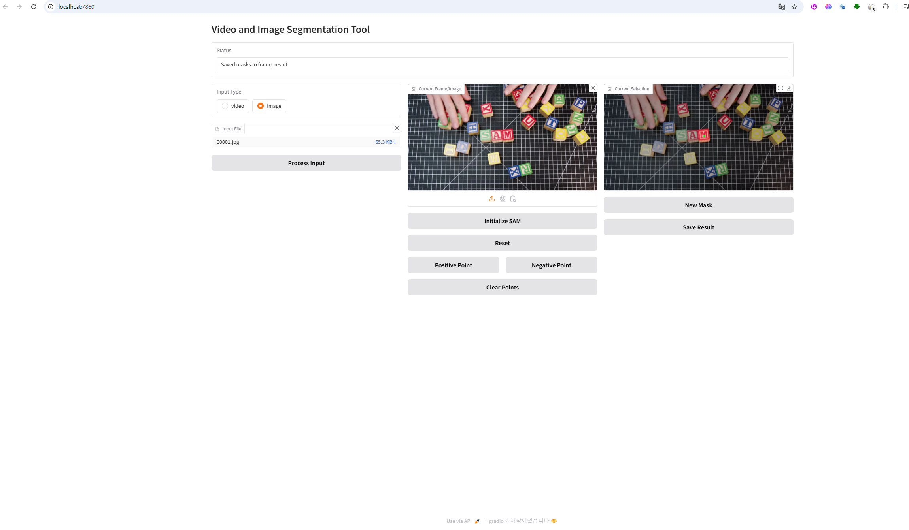
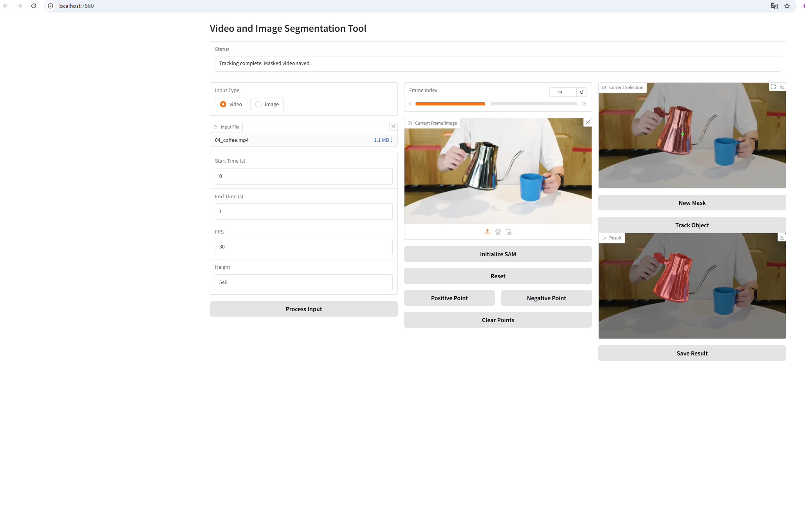

# SAM2-GUI


## SAM2-GUI Setup Guide

## Overview
SAM2-GUI is a powerful graphical user interface designed to facilitate image and video segmentation using the SAM (Segment Anything Model) framework. This tool allows users to interactively segment objects in images and videos with ease, providing both flexibility and efficiency. The application is built upon the [SAM2-GUI](https://github.com/YunxuanMao/SAM2-GUI) repository and integrates enhancements for improved functionality, including customizable save paths for segmentation results.

**Key Features:**
- Interactive segmentation for both images and videos
- Support for multiple segmentation prompts (points and boxes)
- Temporal consistency for video segmentation
- Flexible saving options with default and user-specified directories
- Integration with Gradio for a user-friendly web interface

For detailed information about the SAM framework, refer to the [SAM2 GitHub Repository](https://github.com/facebookresearch/sam2). Ensure you replace the `build_sam.py` file as instructed after completing the SAM2 setup.

## Table of Contents
- [Prerequisites](#prerequisites)
- [Setting Up the Directory Structure](#setting-up-the-directory-structure)
- [Installation](#installation)
- [Configuration](#configuration)
- [Usage](#usage)
  - [Basic Usage](#basic-usage)
  - [Custom Configuration](#custom-configuration)
  - [Public Sharing](#public-sharing)
- [Features](#features)
  - [Image Segmentation](#image-segmentation)
  - [Video Segmentation](#video-segmentation)
  - [Model Variations](#model-variations)
- [Saving Segmentation Results](#saving-segmentation-results)
- [Notes](#notes)
- [Troubleshooting](#troubleshooting)
- [License](#license)

## Prerequisites
Before setting up SAM2-GUI, ensure you have the following installed:
- Python 3.11
- [Conda](https://docs.conda.io/en/latest/miniconda.html) (recommended for environment management)
- [FFmpeg](https://ffmpeg.org/download.html) with `libx264` support

**Note:** GPU is highly recommended for optimal performance, especially for video segmentation tasks.

## Setting Up the Directory Structure
To properly configure SAM2-GUI, set up the correct directory structure and symbolic links. Run the following commands in your terminal:

```bash
# Create the configuration directory structure
mkdir -p configs/sam2.1

# Create symbolic links to the configuration files
ln -s /your_directory/sam2/sam2/configs/sam2.1/sam2.1_hiera_t.yaml configs/sam2.1/
ln -s /your_directory/sam2/sam2/configs/sam2.1/sam2.1_hiera_b+.yaml configs/sam2.1/
ln -s /your_directory/sam2/sam2/configs/sam2.1/sam2.1_hiera_l.yaml configs/sam2.1/
ln -s /your_directory/sam2/sam2/configs/sam2.1/sam2.1_hiera_s.yaml configs/sam2.1/
```

**Replace `/your_directory/sam2/` with the actual path to your SAM2 installation directory.**

**Replace sam2_gui/build_sam.py file with the sam2/sam2/build_sam.py in sam2 repository**
## Installation
Follow these steps to install the necessary dependencies and set up the environment:

1. **Clone the Repository:**
   ```bash
   git clone https://github.com/YunxuanMao/SAM2-GUI.git
   cd SAM2-GUI
   ```

2. **Create a Conda Environment:**
   ```bash
   conda create -n sam2_gui python=3.11
   conda activate sam2_gui
   ```

3. **Install Python Dependencies:**
   ```bash
   conda install -c conda-forge gradio imageio opencv loguru
   pip install torch
   ```

4. **Install FFmpeg with `libx264` Support:**
   ```bash
   conda install -c conda-forge ffmpeg
   ```
   
   **Verify FFmpeg Installation:**
   ```bash
   ffmpeg -encoders | grep libx264
   ```
   You should see an output similar to:
   ```
    V..... libx264             libx264 H.264 / AVC / MPEG-4 AVC / MPEG-4 part 10
   ```

## Configuration
The application uses command-line arguments for configuration. The available options are:

```bash
--checkpoint : Path to SAM model checkpoint file (default: “checkpoints/sam2.1_hiera_large.pt”)
--config     : Model configuration file path (default: “configs/sam2.1/sam2.1_hiera_l.yaml”)
--port       : Port for the Gradio interface (default: 7860)
--share      : Create a public Gradio link (optional flag)
--save-dir   : Directory to save output masks and videos (default: "frame_result")
```

## Usage

### Basic Usage
Run the application with default settings:
```bash
python mask_app.py
```

### Custom Configuration
Specify custom paths for the checkpoint and configuration files, and set a custom save directory:
```bash
python mask_app.py --checkpoint /path/to/checkpoint.pt --config /path/to/config.yaml --save-dir /path/to/save_directory
```

### Public Sharing
Create a public Gradio link accessible over the internet:
```bash
python mask_app.py --share
```

**Example:**
```bash
python mask_app.py --checkpoint checkpoints/sam2.1_hiera_large.pt --config configs/sam2.1/sam2.1_hiera_l.yaml --port 7860 --share --save-dir ./output_masks
```

## Features

### Image Segmentation
- **Supported Formats:** JPEG (`.jpg`, `.jpeg`)
- **Interactive Segmentation:** Use points or bounding boxes to segment objects.
- **Multiple Segment Selection:** Create multiple masks within a single image.
- **Live Preview:** Real-time visualization of segmentation results.



### Video Segmentation
- **Supported Formats:** MP4 (`.mp4`)
- **Frame-by-Frame Segmentation:** Segment objects on a per-frame basis.
- **Temporal Consistency:** Ensures consistent segmentation across frames.
- **Interactive Editing:** Modify segmentation masks interactively for better accuracy.



### Model Variations
SAM2 offers different model configurations to suit various computational resources and accuracy requirements:
- **`sam2.1_hiera_t.yaml`:** Small model variant.
- **`sam2.1_hiera_b+.yaml`:** Basic+ model variant.
- **`sam2.1_hiera_l.yaml`:** Large model variant.
- **`sam2.1_hiera_s.yaml`:** Small model variant.

**Choose the appropriate model based on your needs and available hardware resources.**

## Saving Segmentation Results
SAM2-GUI allows you to save segmentation results either to the default `frame_result` directory or to a user-specified directory.

### Default Save Directory
By default, masks and segmented videos are saved in the `frame_result` directory within the parent directory of your image or video files.

### Custom Save Directory
You can specify a custom directory to save the results by using the `--save-dir` argument when running the application:
```bash
python mask_app.py --save-dir /path/to/custom_save_directory
```

Alternatively, within the Gradio interface, you can input a desired save directory or use the provided "Browse Directory" button to select one.

**Example Usage:**
```bash
python mask_app.py --save-dir ./my_custom_masks
```

This command will save all segmentation results to the `my_custom_masks` directory.

## Notes
- **GPU Recommendation:** For optimal performance, especially during video segmentation, a GPU is highly recommended.
- **Directory Permissions:** Ensure that the application has write permissions to the save directories to avoid any permission-related errors.
- **Gradio Interface:** The user-friendly Gradio web interface allows for easy interaction with the segmentation tool, making it accessible even to those without programming experience.
- **Temporary Files:** The application creates temporary directories (`temp_image`, `extracted_frames`) during processing, which are automatically cleaned up after completion.

## Troubleshooting

### FFmpeg Error: `Unrecognized option 'preset'.`
**Cause:** The installed FFmpeg version does not support the `-preset` option, likely because `libx264` is not enabled.

**Solution:**
1. **Remove Existing FFmpeg (if necessary):**
   ```bash
   conda remove ffmpeg
   ```
2. **Install FFmpeg with `libx264` Support:**
   ```bash
   conda install -c conda-forge ffmpeg
   ```
3. **Verify Installation:**
   ```bash
   ffmpeg -encoders | grep libx264
   ```
   Ensure that `libx264` is listed among the encoders.

### "Default configuration not found" Error
**Possible Causes:**
1. Symbolic links to configuration files are not set up correctly.
2. Incorrect paths in the symbolic links.
3. Configuration files are missing or moved from their original locations.

**Solutions:**
1. **Ensure Symbolic Links Are Correct:**
   ```bash
   ls -l configs/sam2.1/
   ```
   Verify that all symbolic links point to the correct configuration files.

2. **Recreate Symbolic Links:**
   ```bash
   ln -sf /your_directory/sam2/sam2/configs/sam2.1/sam2.1_hiera_t.yaml configs/sam2.1/
   ln -sf /your_directory/sam2/sam2/configs/sam2.1/sam2.1_hiera_b+.yaml configs/sam2.1/
   ln -sf /your_directory/sam2/sam2/configs/sam2.1/sam2.1_hiera_l.yaml configs/sam2.1/
   ln -sf /your_directory/sam2/sam2/configs/sam2.1/sam2.1_hiera_s.yaml configs/sam2.1/
   ```

3. **Check File Locations:**
   Ensure that the configuration files exist in the specified paths and have not been moved or deleted.

### "No masks to save" or "No masks to save. Please run tracking first."
**Cause:** Attempting to save masks before performing segmentation or tracking.

**Solution:**
1. **Perform Segmentation:**
   - For images: Initialize SAM and add points to create masks.
   - For videos: Extract frames, initialize SAM, perform tracking to generate masks.

2. **Ensure Masks Are Generated:**
   After segmentation or tracking, verify that masks are available before attempting to save.

### General Errors
- **Check Console Logs:** Review the console output for detailed error messages and stack traces.
- **Permissions:** Ensure that the application has the necessary permissions to read input files and write to output directories.
- **Dependencies:** Verify that all required Python packages and FFmpeg are correctly installed and configured.

## License
[MIT License](LICENSE)

